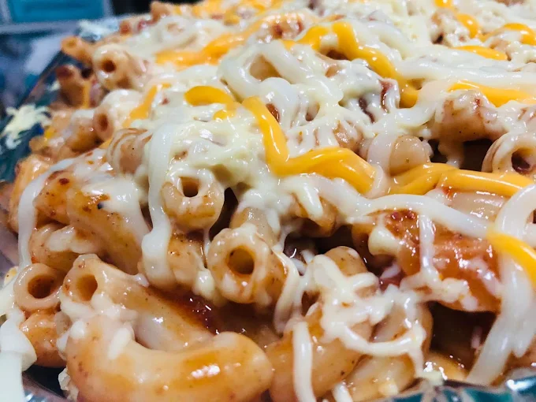

# Editable Content Guide

Plain-language guide for whoever maintains the site. The redesign splits the old single file into a small `index.html` plus a resources folder, so edits are easier to find.

```
tita-maricar-website/
├── index.html          ← all text + page structure
├── css/styles.css      ← colours, fonts, spacing (design only)
├── js/main.js          ← menu button, scroll animations (rarely touched)
├── img/
│   ├── hero/           ← hero photo
│   ├── trays/          ← made-to-order photos
│   └── logo/           ← logo + favicon files
├── favicon.ico         ← browser tab icon
├── site.webmanifest    ← app name + icons (for "Add to Home Screen")
└── img/og-image.png    ← image shown when the link is shared
```

## Fastest way to edit

Open `index.html`, press `Ctrl+F`, and search for **`EDIT:`**. Every placeholder that needs a real value has an `EDIT:` comment right above it.

## Quick replacement list (all in `index.html`)

| What to change | How to find it | Notes |
| --- | --- | --- |
| **Instagram link** | search `instagram.com` | Appears in nav, hero, trays, social, footer. Replace every one with the real IG profile or DM link. |
| **TikTok link** | search `tiktok.com` | Social section + footer. |
| **Phone number** | search `tel:+639000000000` and `+63 9XX` | Replace both the dialable `tel:` link and the displayed number. |
| **Address** | search `Calo, Bay, Laguna, Philippines` | Update to the exact street/landmark when ready. |
| **Map** | search `output=embed` | Change the `q=...` query to the exact place; use `+` for spaces. |
| **Open hours** | search `7 AM` | Topbar, hero, location, footer. Update all if hours change. |
| **Daily ulam list** | search `ulam-item` | One dish per block (see below). |
| **Tray items / photos** | search `tray-card` | One tray per block (see below). |

## Editing the daily ulam list

Each dish is one block inside the `ulam-grid`:

```html
<div class="ulam-item"><span class="name">Pork Adobo</span><span class="leader" aria-hidden="true"></span><span class="tag">Rice meal</span></div>
```

- Change the **name** (`Pork Adobo`) and the small **tag** (`Rice meal`, `Soup`, `Gulay`, etc.).
- To mark a house favourite, add `is-star`: `<div class="ulam-item is-star">` — it gets a gold ★.
- Keep `<span class="leader" ...></span>` — that's the dotted line.
- **Prices are intentionally not shown** (the menu changes daily and prices stay "sample only" until confirmed). To add a price, put it in the `tag` span, e.g. `<span class="tag">₱85</span>` — only after the owner confirms the real price.

## Editing a made-to-order tray

Each tray is one `article`:

```html
<article class="tray-card tray-card--wide">
  
  <span class="chip">Bestseller</span>
  <div class="body">
    <h3>Cheesy Baked Macaroni</h3>
    <p>Good for 8–12 · order 1–2 days ahead</p>
  </div>
</article>
```

- Replace the photo by dropping a new image into `img/trays/` and updating `src` + the `alt` description.
- The first tray uses `tray-card--feature` (the large one). Keep one feature; the rest use `tray-card--wide`.
- Update the `chip` label, the `<h3>` name, and the `<p>` serving/lead-time line.

## Replacing the logo

The logo lives in `img/logo/`. `icon-192.png` is what the nav/footer actually display; `icon-512.png` is the largest copy (also the app icon), and the favicon files are smaller sized copies. The original full-resolution logo PNG is kept in the project root (one level up from this site folder).

To change the logo, you need to regenerate the icon sizes from the new image (16, 32, 48, 180, 192, 512 px + `favicon.ico` + `img/og-image.png`). Easiest options:
1. Ask the developer to re-run the icon-generation step, **or**
2. Use a free favicon generator (e.g. realfavicongenerator.net), upload the new logo, and replace the files in `img/logo/` + `favicon.ico` with the same filenames.

## Photos

- Hero: `img/hero/hero-pancit.webp`. Swap for any appetising wide dish photo; keep the filename or update the `src` in the hero section.
- Trays: `img/trays/*.webp`.
- Share image: `img/og-image.png` (shown on Facebook/Messenger/Viber link previews). Regenerate if the logo or name changes.

## What you should NOT need to touch

- `css/styles.css` and `js/main.js` control the look and behaviour. Leave them unless you're doing a design change.
- Colours are defined once at the top of `styles.css` under `:root` (e.g. `--terracotta`, `--gold`, `--green`) if you ever want to tweak the palette.
